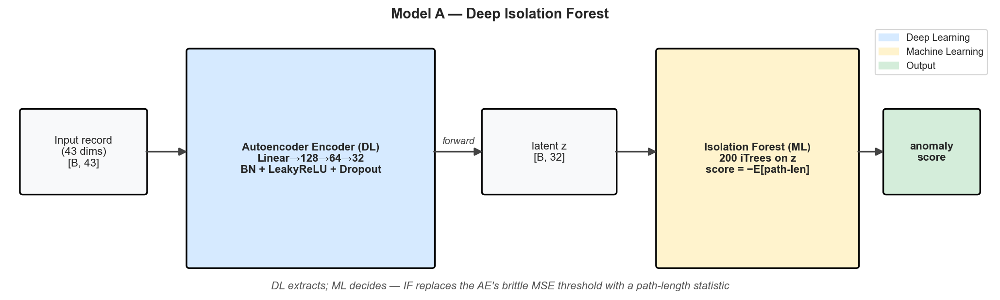
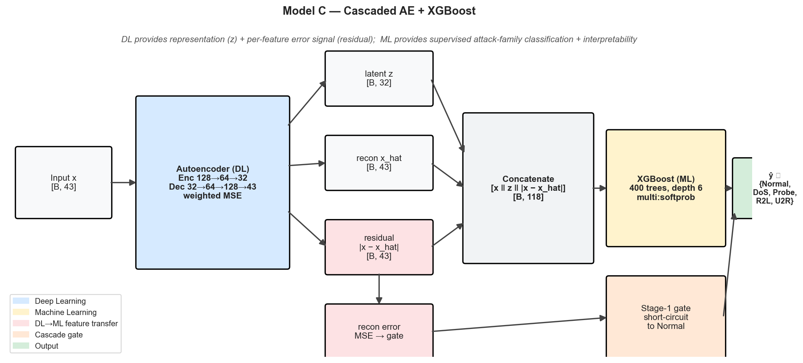
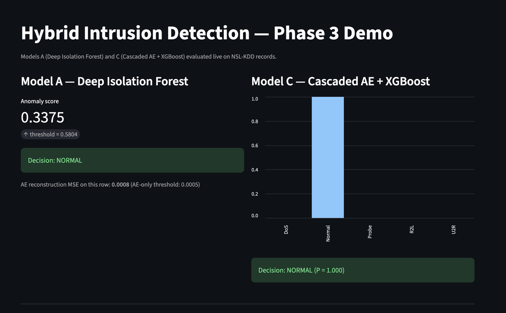

# Phase 3: Hybrid ML + DL Intrusion Detection on NSL-KDD

## Problem Statement
Phase 3 unifies the classical ML baselines from Phase 1 (Z-Score, Isolation Forest)
and the deep one-class detectors from Phase 2 (Autoencoder, VAE) into two
**hybrid architectures** that explicitly couple the two paradigms.

The motivation comes directly from a Phase-2 weakness: the deep autoencoder
achieved ROC-AUC = 0.93 but precision was only 0.58 on the held-out NSL-KDD test
set. Recall saturated at 1.0, indicating the reconstruction-error threshold was
too permissive. Phase 3 replaces this brittle threshold with an ML decision
mechanism operating on the AE's latent space, and it adds a supervised
attack-family classifier for triage.

## Hybrid Architectures

### Model A — Deep Isolation Forest (DIF)
The Phase-2 autoencoder encodes a record into a 32-dimensional latent vector
`z`. An Isolation Forest is then trained on `z` (not on the raw 43-D input).
The final anomaly score is the IF isolation score in latent space.

**Why this is a hybrid, not glue:**
- The AE solves IF's curse-of-dimensionality on heterogeneous tabular features.
- IF replaces the AE's arbitrary MSE threshold with a principled isolation-based
  decision boundary, fixing the over-flagging behaviour observed in Phase 2.

### Model C — Cascaded AE + XGBoost (CAX)
Two-stage IDS pipeline:
- **Stage 1 (DL, semi-supervised):** AE flags anomaly via reconstruction error.
- **Stage 2 (ML, supervised):** XGBoost takes the concatenated feature vector
  `[raw_features ‖ AE_latent_z ‖ per_feature_residuals]` and classifies into
  `{Normal, DoS, Probe, R2L, U2R}`.

The per-feature residuals are the novel signal — they tell XGBoost *which*
dimensions the AE failed to reconstruct, transferring information from the
DL component into the ML component.

## Repository Structure
```
Phase 3/
├── 01_introduction_hybrid.ipynb     # Motivation + literature
├── 02_data_preparation.ipynb        # Splits + preprocessing (binary + multi-class)
├── 03_deep_isolation_forest.ipynb   # Model A
├── 04_cascaded_ae_xgboost.ipynb     # Model C
├── 05_ablation_study.ipynb          # ML-only vs DL-only vs Hybrid table
├── 06_final_comparison.ipynb        # Phase 1 vs Phase 2 vs Phase 3 + report
├── run_all.sh                       # Executes notebooks 02-06 and verifies artifacts
├── utils/
│   ├── config.py                    # Paths, seeds, device, NSL-KDD schema
│   ├── data_loader.py               # NSL-KDD loading + leakage-safe splits
│   ├── hybrid_models.py             # DeepIsolationForest, CascadedAE_XGB, AE
│   └── evaluation.py                # Binary + multi-class metrics, plotting
├── app/
│   ├── streamlit_app.py             # Live demo UI (Extra Mile)
│   └── Dockerfile                   # Reproducible container (Extra Mile)
├── models/                          # Saved AE, IF, XGBoost, scaler
├── results/                         # CSVs and metric tables
├── figures/                         # PNG figures for the report
├── references/                      # User-provided references
├── requirements.txt
└── README.md
```

## Data Pipeline (Leakage-Safe)
- NSL-KDD train/test loaded from `../Phase 1/data/`.
- Categorical encoders fit on training data only; unseen test categories → -1.
- Engineered features: `bytes_ratio`, `error_rate_diff`, `srv_diversity`.
- `StandardScaler` fit on train-normal only.
- AE trains on 80 % of train-normal (Phase-2 split, preserved here).
- XGBoost trains on the *remaining* train rows (held-out normal + all attacks)
  with attack-family labels — never sees AE's training samples.
- Threshold and hyperparameters tuned on the validation split only.
- Final NSL-KDD test set used exactly once for reporting.

## How to Run
```bash
pip install -r requirements.txt

# Run notebooks 02-06 in order and verify required outputs
bash run_all.sh
```

### Streamlit demo (Extra Mile)
```bash
streamlit run app/streamlit_app.py
```

### Docker (Extra Mile)
Run this from the repository root, not from inside `Phase 3/`, because the
Dockerfile copies both `Phase 1/data` and `Phase 3`.

```bash
docker build -t phase3-ids -f "Phase 3/app/Dockerfile" .
docker run --rm -p 8501:8501 phase3-ids
```

## Phase 3 Evaluation Evidence

### Hybrid Innovation
Implemented evidence:
- Model A, Deep Isolation Forest, couples a deep autoencoder encoder with an
  Isolation Forest decision boundary on the AE latent space.
- Model C, Cascaded AE + XGBoost, trains XGBoost on
  `[raw_features | AE_latent_z | per_feature_residuals]`, making the AE's
  reconstruction failures a supervised ML signal.
- The final comparison is generated in `results/phase3_full_comparison.csv`.
- Model C's DL-to-ML feature-block usage is saved in `results/modelC_scores.npz`
  and visualized through the SHAP block plot generated by notebook 04.

Interpretation:
Model C is the strongest hybrid submission artifact: the full hybrid feature set
improves over the Phase-3 raw XGBoost ML-only baseline from F1 0.805 to 0.818
and AUC 0.960 to 0.964. It also improves over the AE-only DL baseline from F1
0.731 to 0.818 and AUC 0.954 to 0.964. The SHAP block evidence shows XGBoost is
not ignoring the deep component: raw features account for 52.0% of attribution,
latent features for 22.1%, and residual features for 25.9%. The honest caveat is
that the Phase-1 Isolation Forest still has the highest F1 overall at 0.874, so
the hybrid claim should be framed as stronger Phase-3 integration and AUC/feature
evidence, not as best overall F1.

| Model | Accuracy | Precision | Recall | F1 | AUC | Evidence File |
|---|---:|---:|---:|---:|---:|---|
| Best ML-only baseline | 0.848 | 0.825 | 0.930 | 0.874 | 0.940 | `results/phase3_full_comparison.csv` |
| Best DL-only baseline | 0.582 | 0.577 | 1.000 | 0.732 | 0.941 | `results/phase3_full_comparison.csv` |
| Deep Isolation Forest | 0.758 | 0.926 | 0.626 | 0.747 | 0.927 | `results/modelA_dif_metrics.csv` |
| Cascaded AE + XGBoost | 0.820 | 0.967 | 0.709 | 0.818 | 0.964 | `results/modelC_cax_metrics_binary.csv` |

### Ablation Studies
Implemented evidence:
- Notebook 05 evaluates ML-only, DL-only, partial hybrid, full hybrid, and gated
  cascade variants on the same NSL-KDD test set.
- The ablation table is generated at `results/ablation_phase3.csv`.
- Component-level F1 deltas are generated at `results/ablation_phase3_deltas.csv`.
- Ablation figures are generated in `figures/phase3_ablation_f1.png` and
  `figures/phase3_ablation_auc.png`.

Interpretation:
The full Model C hybrid improves over the Phase-3 ML-only raw XGBoost baseline by
+0.013 F1 and +0.004 AUC. It improves over the DL-only AE baseline by +0.087 F1
and +0.009 AUC. Residual features are the most useful AE-derived component:
raw + residuals reaches F1 0.819, while raw + latent reaches F1 0.807. Removing
residuals from the full hybrid drops F1 from 0.818 to 0.807. Removing latent
features does not hurt in this run; raw + residuals slightly exceeds the full
raw + latent + residual model by +0.001 F1 and +0.002 AUC. The AE gate is not
beneficial for the binary metric here: the gated cascade drops from F1 0.818 to
0.731, so the ungated full hybrid is the stronger submission result.

| Experiment | F1 | AUC | Delta vs Full Hybrid |
|----------|----|-----|----------------------|
| ML Only | 0.805 | 0.960 | -0.013 |
| DL Only | 0.731 | 0.954 | -0.087 |
| Raw + Latent | 0.807 | 0.963 | -0.010 |
| Raw + Residual | 0.819 | 0.966 | +0.001 |
| Full Hybrid | 0.818 | 0.964 | +0.000 |

Component deltas from `results/ablation_phase3_deltas.csv`:

| Change | F1 Delta |
|---|---:|
| Latent representation (5 vs 4) | +0.002 |
| Residual signal (6 vs 4) | +0.014 |
| Latent + residuals together (7 vs 4) | +0.013 |
| AE gate on top (8 vs 7) | -0.087 |
| Hybrid vs raw IF (3 vs 2) | -0.068 |
| Hybrid vs AE alone (3 vs 1) | +0.016 |

### Architecture Diagram
Implemented evidence:
- Notebook 06 generates publication-style diagrams for both hybrid
  architectures.
- Model A diagram artifact: `figures/diagram_model_A.png`.
- Model C diagram artifact: `figures/diagram_model_C.png`.
- The diagrams include tensor shapes, DL/ML component boundaries, and the
  Model C fusion mechanism.

Interpretation:
The diagrams are generated artifacts, not hand-drawn screenshots. They show the
specific fusion mechanism for Model C, including `x`, `z`, `|x - x_hat|`, and
the `[B, 118]` concatenated feature vector, which directly supports the
architecture-diagram rubric.





### Reproducibility
Implemented evidence:
- `requirements.txt` contains the runtime packages needed for notebook
  execution, modeling, plotting, SHAP analysis, Streamlit, and nbconvert.
- `run_all.sh` creates required output directories, executes notebooks 02-06 in
  order, stops on the first error, and verifies the required CSV/NPZ/PNG
  artifacts.
- The data loader uses relative paths and leakage-safe train/validation/test
  splits.
- Docker support is provided through `app/Dockerfile`.

Interpretation:
`./run_all.sh` was executed successfully and verified all required artifacts.
This means the Phase-3 pipeline is not just documented; it has been run end to
end from notebooks 02-06 with generated metrics, diagrams, SHAP evidence, and
final comparison outputs.

Required artifacts checked by `run_all.sh`:

| Verified | Artifact | Purpose |
|---|---|---|
| [x] | `results/phase3_full_comparison.csv` | Final cross-phase comparison table |
| [x] | `results/ablation_phase3.csv` | ML-only, DL-only, and hybrid ablation metrics |
| [x] | `results/ablation_phase3_deltas.csv` | Component contribution deltas |
| [x] | `results/modelC_scores.npz` | Model C scores and SHAP block shares |
| [x] | `figures/diagram_model_A.png` | Deep Isolation Forest architecture diagram |
| [x] | `figures/diagram_model_C.png` | Cascaded AE + XGBoost architecture diagram |

### Extra Mile
Implemented evidence:
- Streamlit demo in `app/streamlit_app.py` for live NSL-KDD sample inspection.
- Docker support in `app/Dockerfile` for containerized demo execution.
- SHAP explainability in notebook 04, including feature-block importance for raw
  features, AE latent features, and AE residual features.
- Reproducible pipeline through `run_all.sh`.

Interpretation:
The extra-mile work includes a functional demo path, containerization path,
explainability evidence, and a reproducible execution script. SHAP evidence is
already generated in `figures/phase3_cax_shap_blocks.png`. The packaged
Streamlit interface demonstrates real-time interpretability and model comparison
beyond static experimentation.

#### Interactive Streamlit Demo



- Runs live inference on NSL-KDD samples from the processed Phase-3 test split.
- Compares Model A Deep Isolation Forest anomaly scoring against Model C
  Cascaded AE + XGBoost class probabilities and predictions.
- Visualizes reconstruction residuals, making the DL-to-ML signal flow visible
  through the autoencoder residual features used by XGBoost.
- Supports interactive sample selection by random row, attack family, or custom
  test-set index.

## Results Summary
Final consolidated metrics live in `results/phase3_full_comparison.csv` and
include every model from Phase 1, Phase 2, and Phase 3 evaluated on the same
held-out NSL-KDD test set. See `06_final_comparison.ipynb` for figures and
`results/report.md` for the written analysis.
